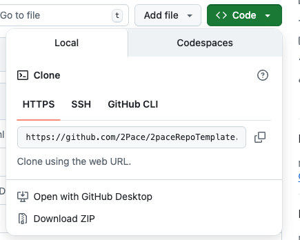
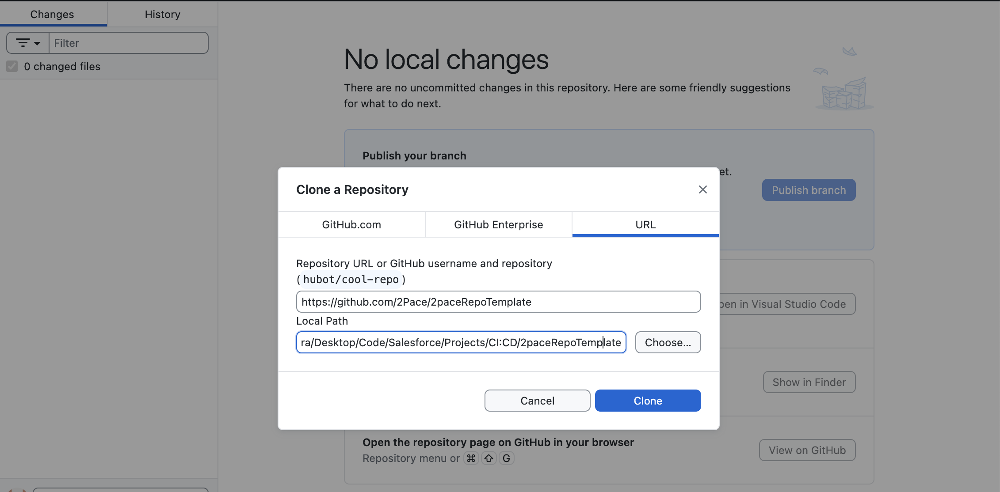
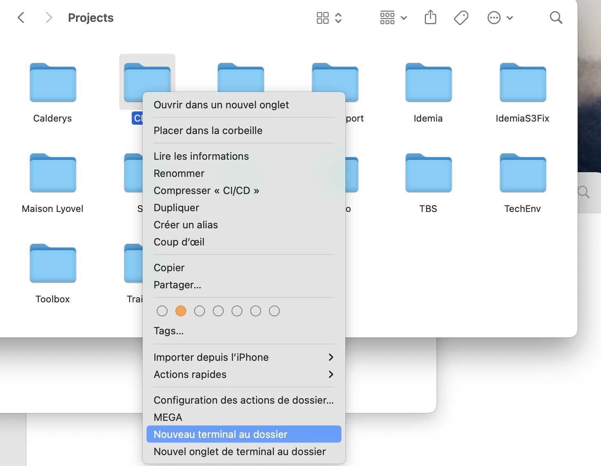
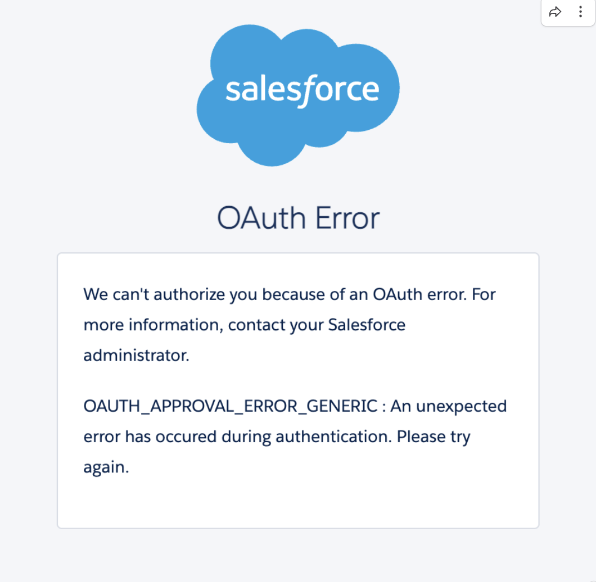
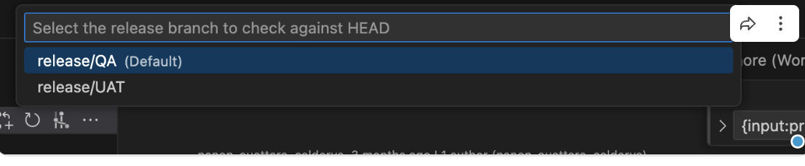

# Usage
  # 🛠️ Processus CI/CD – Déploiement Feature-by-Feature

  Le processus CI/CD est basé sur une approche de déploiement **feature-by-feature** à la charge des responsables de la mise en place de ces features.
  Chaque fonctionnalité est développée dans une **branche dédiée**, puis intégrée progressivement dans une chaîne de branches de release.

  Ex :

  ```
  release/QA → release/SIT → release/UAT → release/PROD
  ```

  ---

  ## 🚀 Déploiement des Fonctionnalités

  1. Une **Pull Request** (PR) est ouverte de la branche de fonctionnalité contenant la metadonnée de dev vers la première Org de notre cycle de déploiement. (vers **release/QA** dans notre exemple).  
  2. Si le merge est possible (aucun conflit) la validation de la metadonnée est déclenchée. La branche doit être validé avant de pouvoir faire un merge sur la branche cible.
  3. Après validation du workflow associé, le **merge de la PR déclenche automatiquement le déploiement** vers l’organisation representé par la branche cible. **(release/QA = QA)**.
  4. Le même cycle est répété avec des PR successives :
    - `featureBranch → release/SIT`
    - `featureBranch → release/UAT`
    - `featureBranch → release/PROD`
  5. Des deploiements groupés (pour pousser tout un sprint par exemple) peuvent être effectués en promouvant l'ensemble des modifications d'une branche de release vers une autre :
    - `release/QA → release/SIT`
    - `release/SIT → release/UAT`
    - `release/UAT → release/PROD`

  Chaque fusion de branche entraîne un **déploiement automatique** dans l’environnement correspondant.

  ## 🧑‍🔧 Mise en place (Consultant)

  ## 📋 Pré-requis

  Avant de commencer, assurez-vous d'avoir installé :

  * 🍺 [Guide d’intallation complet](https://www.notion.so/Brew-Base-1521ee99e4c38084a387ec1b5f8fd5db) avec Brew
  * ✅ [Visual Studio Code](https://code.visualstudio.com/docs/setup/mac)
  * ✅ [Salesforce CLI](https://developer.salesforce.com/tools/salesforcecli)
  * ✅ [Extension Salesforce pour VSCode](https://marketplace.visualstudio.com/items?itemName=salesforce.salesforcedx-vscode)
  * ✅ [Java](https://www.oracle.com/java/technologies/downloads/#java21)
  * ✅ Git : executez `brew install git` dans votre terminal
  * ✅ gh : executez `brew install gh` dans votre terminal
  * ✅ [Github Desktop](https://desktop.github.com/download/) (optionnel)
  * ✅ SFDX-Hardis : executez `sf plugins install sfdx-hardis` dans votre terminal

  Mais aussi :

  * ✅ Avoir vos accès à GitHub
  * ✅ Avoir accès à votre repository GitHub

  ---

  ## 🌿 Étape 1 : Cloner le repertoire GitHub sur votre machine pour avoir une base de travail

  En tant que consultant, après avoir installé tous les éléments necessaires, votre parcours d'intégration et de déploiement continu débute ici.
  Rendez vous sur le repertoire de votre projet (Normalement créé par votre Release Manager sur la base du Template 2PACE).
  
  Afin de cloner ce repertoire vous avez 2 possibilités. Déjà identifiez le bouton Code (image ci-dessous) puis cliquez dessus :

  

  1. **Via GitHub Desktop**
    
    Open with Github Desktop -> Choisissez l'emplacement qui vous convient sur votre machine puis "Clone" -> Open in Visual Studio Code
  

  2. 
    Copiez le lien HTTPS -> Ensuite clic droit sur le dossier dans lequel vous voulez avoir le repertoire -> Nouveau terminal au dossier -> Dans le terminal exexutez : 
    ```
    git clone -b main le_lien_https_copié
    ```

    
    Un dossier du nom de votre repertoire GitHub a été créé à l'emplacement choisi. Vous pouvez l'ouvrir avec VSCode.

  ---

  ## 💾 Étape 2 : Créer un dossier local et une branche sur GitHub pour une Feature

  Dans VSCode ouvrez la palette de commandes avec **Cmd + Shift + P** puis tapez `run task`  et cliquez sur `Tasks: Run Task`. Vous devrez voir deux actions : 

  ```
  - 2PACE Check Merge & Create PR
  - 2PACE init branch
  ```

  Selectionnez **2PACE init branch** et entrez le nom de votre ticket puis le type de la branche (feature, release, etc.). 

  ⚠️ Veillez à donner un nom précis et pertinent à votre branche. Exemple : `PackageLeadManagementV1` 

  🪄 Votre branche pour votre feature a été créé sur le repertoire GitHub et un dossier lui étant directement lié a été aussi créé dans votre environnement de travail !

  🪄 Ouvrez le avec VSCode et Bravo vous pouvez maintenant entierement vous consacrer à l'implementation de votre feature.

  💡 Cette branche vous permettra de regrouper l’ensemble des métadonnées que vous souhaitez déployer pour cette feature !  

  ---

  ## 🔑 Étape 3 : Connexion à ton environnement Salesforce

  Depuis VSCode Clique en bas à gauche sur **"No Default Org Set"** >  
  "SFDX : Authorize an Org"

  Sélectionne ensuite le type d’org (Production / Sandbox / Custom).  
  ⚠️ IMPORTANT : Donnez un nom précis : ex. `ProjetInterneUAT`.

  VSCode ouvre une page web → connecte-toi avec ton login Salesforce. 🎉

  ---

  ### ⚠️ Problème connu de connexion

  Si cette erreur apparaît :  

  

  → Aller dans Setup > Connected Apps OAuth Usage > Installer "Salesforce CLI"  
  → Ensuite aller dans Setup > Manage Connected Apps > Salesforce CLI > Edit Policies  
  → Mettre **"Admin approved users are pre-authorized"** dans Permitted Users  
  → Sauvegarder  
  → Puis dans la section "Profiles"/"Permset" > Cliquer sur Manage Profiles > Ajouter le profil **System Administrator**

  ---

  ## 📦 Étape 4 : Récupérer les métadonnées Salesforce

  C'est le moment de récupérer les champs, classes Apex, layouts, lightning pages…

  ### Alternative 1

  1. Dans VSCode, cliquer sur l’icône Salesforce (nuage)
  2. Parcourez les types de métadonnées
  3. Déroulez pour accéder aux composants
  4. Cliquez sur l’icône "télécharger" pour les récupérer

  Ils apparaîtront dans : `force-app/main/default`

  ---

  ### Alternative 2 : SFDX Hardis — Metadata Retriever

  1. Cliquer sur l’icône “infini”
  2. Cliquer sur **Welcome**
  3. Ouvrir **Metadata Retriever**
  4. Filtrer par type ou date
  5. Sélectionner puis **Retrieve Selected Metadata**

  Voilà tu es fin prêt à créer ton package ! 💪


  ---

  ## 🔍 Étape 5 : Créer ta Pull Request

  1. (Uniquement la 1re fois) Executer dans le terminal pour Authentification GitHub :

  ```
  gh auth login
  ```

  2. Ouvrir la palette de commande : **Cmd + Shift + P**, tapez `run task`  et cliquez sur `Tasks: Run Task`
  3. Sélectionnez : **2PACE Check Merge & Create PR** 
  4. Choisissez la branche cible

  

  5. Entrez un nom de la PR puis valider  
  6. Entrez une description puis valider  
  7. Allez sur GitHub pour finaliser

  ---

  ## ⚔️ Étape 6 : Gérer les conflits (si nécessaire)

  Si une erreur apparaît lors de la validation :

  1. Cliquer sur **Resolve conflicts**
  2. Parcourez les fichiers et choisissez la bonne option de reconciliation en fonction des cas :

  → **Accept Current Change** : garder votre version  
  → **Accept Incoming Change** : garder la version de la cible  
  → **Accept Both Changes** : Superposer les deux modifications
  → **Compare Changes**  

  3. Une fois fini → **Commit merge**

  🎉 Conflits résolus !

  ---

  ## 🚀 Étape 7 : Validation et déploiement final

  1. Git déclence un worflow qui valide la métadonnée  
  2. Si la branche n’est plus à jour → **Update Branch**  
  3. Quand tout est OK → Cliquer sur **Squash and merge** pour faire le merge.

  🎉 C'est fait ! Vous avez déployé votre package 🚀
  ⚠️ Mais surtout on oublie pas de tester ses fonctionnalités dans l'environnement cible