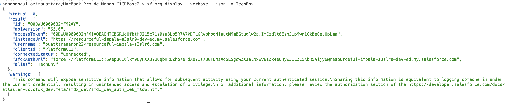
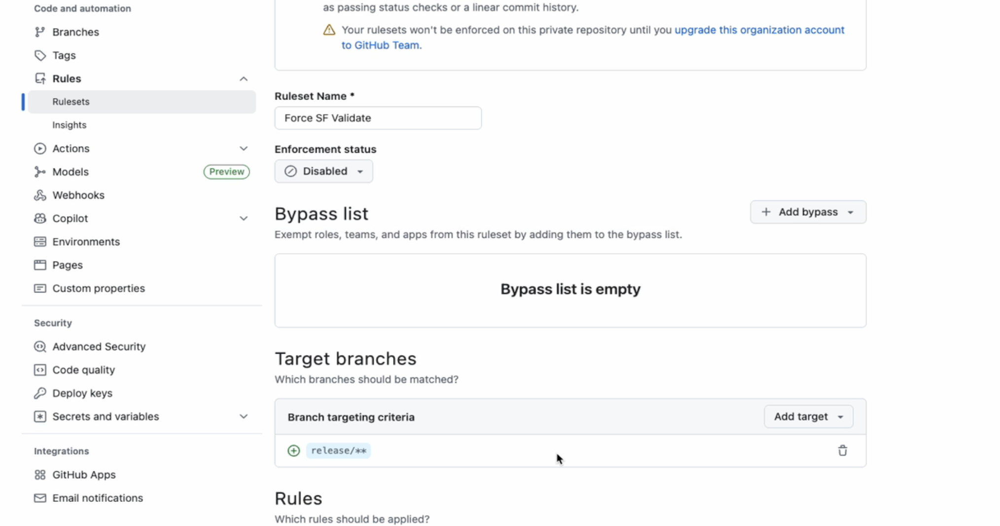
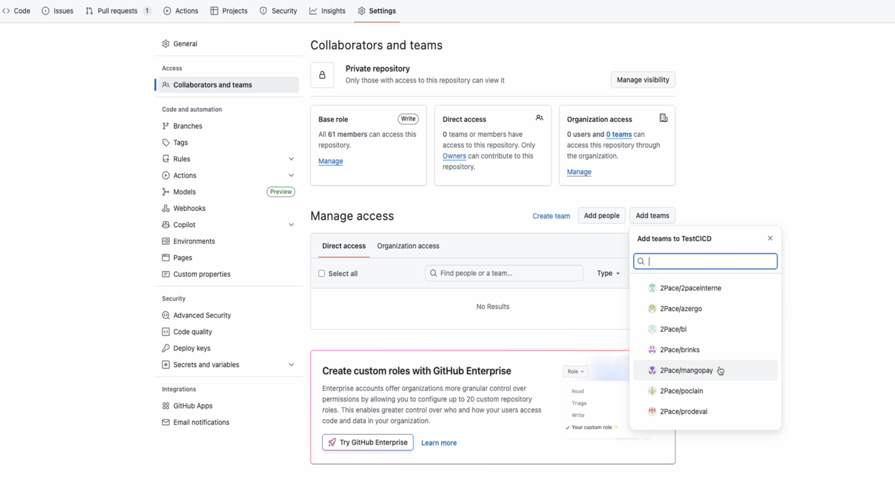

# Mise en place & Fonctionnement des workflows
## 🎯 Objectif du template

Ce template fournit un **socle CI/CD prêt à l’emploi** permettant de :

- Mettre en place rapidement une CI Salesforce sans repartir de zéro
- Standardiser les pratiques DevOps Salesforce dans l’entreprise
- Sécuriser les Pull Requests via une validation automatique
- Faciliter l’onboarding des équipes projets et des Release Managers
- Garantir la cohérence entre environnements

# 1. Mise en place du répertoire

## 1.1 🚀 Salesforce CI/CD Template – Guide d’utilisation

Le repertoire faisant office de base pour la mise en place d'une CI/CD sur les projets 2PACE est le suivant : https://github.com/2Pace/2paceRepoTemplate

En début de projet, rendez vous sur le repertoire puis cliquez sur **Use this template** -> **Create new repository** ensuite donnez un nom à votre nouveau repertoire projet puis finalisez sa création.

Une fois dans votre nouveau repertoire, afin d'implémenter le **SingleOrgBasedCICD** vous allez déplacer les fichiers deploy.yml et validate.yml que vous trouverez sous le chemin **.github/workflows/deployment/SingleOrgBasedCICD/**. Ces fichiers doivent être déplacer sous **.github/workflows/**

⚠️ Attention : vous ne pourrez pas déplacer les fichiers directement sur GitHub. Vous allez devoir cloner le répertoire, faire la manipulation, puis pousser la nouvelle version.


## 1.2 🔌 Configuration des accès Salesforce

### GitHub Secrets

Chaque environnement Salesforce doit disposer d’un secret dédié :

```
SFDXAUTHURL_QA
SFDXAUTHURL_SIT
SFDXAUTHURL_UAT
SFDXAUTHURL_PROD
```
Ces secrets contiennent les **SFDX Auth URLs** des organisations Salesforce correspondantes.
Pour obtenir un **SFDX Auth URLs** : connectez vous à votre Org via VSCode et dans votre terminal faites la commande suivante :

```
sf org display --verbose --json -o ORGNAME
```

ORGNAME doit être remplacé par le nom que vous avez donneé à votre org lors de la connexion.

À la suite de cette commande vous aurez le resultat suivant : 



La valeur qui nous importe est celle de **sfdxAuthUrl**. Pour chaque environnement créez une variable secrète **SFDXAUTHURL_ORGNAME** et stockez y cette valeur.

---

## 1.3 🌿 Convention de branches

Le template repose sur une convention simple et standardisée pour la nomenclature des branches.

Si vous disposez par exemple des environnement QA;SIT;UAT;PROD pour votre projet, vous allez alors créer pour chacun d'entre eux les branches suivantes : 

```
release/QA
release/SIT
release/UAT
release/PROD
```

Le nom de la branche permet de :
- déterminer automatiquement l’environnement Salesforce cible,
- sélectionner la bonne Auth URL,
- appliquer les règles CI adaptées.

---
## 1.4 🧱 Création du ruleset pour forcer la validation des PR avant déployer

  <!-- Allez dans l'onglet Settings de votre repertoire puis cliquez sur Rules -> Rulesets
 
  -->

 À venir

---
## 1.5 🔐 Donner les droits aux personnes concernés pour acceder au repertoire

  Allez dans l'onglet Settings de votre repertoire puis cliquez sur Collaborators ands teams

  Dans la section **Manage Access** sous l'onglet **Direct Access**, cliquez sur Add people/Add teams et ajoutez les personnes ou les équipes souhaités en determinant les droits d'accès souhaités.



---

# 2. 🔄 Workflow CI/CD – Validation des métadonnées Salesforce sur Pull Request

Ce document décrit le workflow GitHub Actions **Validate SF Metadata PR**, destiné aux **Release Managers** prenant le relais sur un projet Salesforce.

Ce workflow constitue la **brique de validation CI standard** à déployer sur **tout nouveau projet Salesforce** de l’entreprise afin de sécuriser les Pull Requests avant leur intégration dans les branches de release.

---

## 🎯 Objectif du workflow

Ce workflow a pour but de :

- Valider automatiquement les métadonnées Salesforce lors de chaque Pull Request
- Identifier dynamiquement l’environnement cible (QA / SIT / UAT / PROD) à partir de la branche
- Construire un **package delta** (incrémental) des métadonnées modifiées
- Se connecter à l’organisation Salesforce cible via une Auth URL sécurisée
- Lancer une **validation de déploiement en mode check-only (dry-run)**
- Bloquer la Pull Request en cas d’erreur de validation

Il s’agit d’un **contrôle qualité obligatoire** avant toute propagation dans la chaîne de release.

---

## ⚙️ Déclencheur

```
on: pull_request
```

Le workflow s’exécute **automatiquement à chaque Pull Request**, sur toute les branches contenant le workflow.

---

## 🧱 Architecture du job

```
jobs:
  ValidateMetadata:
    runs-on: ubuntu-latest
    container: nanon22/sf-cli-jq:latest
```

### Choix techniques :

- **ubuntu-latest** : runner GitHub standard
- **Container Docker dédié** incluant :
  - Salesforce CLI (`sf`)
  - `sfdx-git-delta`
  - `jq`
  - Environnement NodeJS prêt à l’emploi


---

## 🧩 Étape 1 — Récupération du code source

```
uses: actions/checkout@v5
with:
  fetch-depth: 0
```

- Récupère l’intégralité de l’historique Git
- Indispensable pour calculer un delta fiable entre commits

---

## 🧩 Étape 2 — Détermination de l’environnement Salesforce cible

```
CUTBRANCH=$(echo "${{ github.event.pull_request.base.ref }}" | cut -d'/' -f2 | tr '[:lower:]' '[:upper:]')
echo "ORG_NAME=$CUTBRANCH" >> $GITHUB_ENV
```

### Principe :

- Le nom de la branche cible (`release/qa`, `release/uat`, etc.) est analysé
- La partie après `/` est extraite et normalisée en majuscules
- La variable d’environnement `ORG_NAME` est injectée dans le job

### Exemple :

| Branche cible | ORG_NAME |
|--------------|----------|
| release/qa   | QA       |
| release/uat  | UAT      |
| release/prod | PROD     |

👉 Ce mécanisme permet à **un même workflow** de fonctionner sur toute la chaîne d’environnements.

---

## 🧩 Étape 3 — Initialisation du step *Validate Metadata*

Ce step contient toute la logique métier de validation CI Salesforce.

---

### 3.1 Activation du plugin sfdx-git-delta

```
cd /root/.local/share/sf/node_modules/sfdx-git-delta
sfdx plugins link sfdx-git-delta
```

- Active explicitement le plugin `sfdx-git-delta`
- Indispensable pour générer des packages de métadonnées incrémentaux

---

### 3.2 Sécurisation du contexte Git


```
git config --global --add safe.directory /__w/salesforce/salesforce
```
⚠️⚠️ **Important :** vous devez à chaque fois remplacer "salesforce/salesforce" par "NOM_DE_MON_ORGANISATION/NOM_DE_MON_REPERTOIRE"

---

### 3.3 Identification de la branche cible

```
BRANCH_NAME=${{ github.event.pull_request.base.ref }}
```

- Correspond à la branche **de destination** de la Pull Request
- Utilisée pour :
  - déterminer l’environnement
  - identifier le dernier commit de référence

---

## 🧩 Étape 4 — Calcul du delta de métadonnées

### Récupération du commit de référence

```
LAST_COMMIT_HASH=`git log --pretty=format:"%H" -1 origin/$BRANCH_NAME`
```

### Génération du package delta

```
sf sgd source delta --to "HEAD" --from $LAST_COMMIT_HASH -d --output-dir sgdPackage/
```

Résultat possible :

- `sgdPackage/force-app` (projet DX)
- `sgdPackage/src` (Metadata API)

Les traductions générées automatiquement sont exclues afin de réduire le bruit.

Si **aucune métadonnée n’est détectée**, le workflow s’arrête proprement.

---

## 🧩 Étape 5 — Connexion à l’organisation Salesforce cible

```
echo ${{ secrets[format('SFDXAUTHURL_{0}',  env.ORG_NAME )] }} > ./SFDX_URL.txt
sf org login sfdx-url --sfdx-url-file ./SFDX_URL.txt --set-default
```

- Authentification non interactive
- Utilisation d’un secret GitHub dédié par environnement
- L’org connectée devient l’org par défaut pour le reste du step

---

## 🧩 Étape 6 — Gestion optionnelle des classes de test Apex

```
if [ -f test-classes.txt ]; then
  SF_RUNTESTS=`tr -s '\n' ' ' < test-classes.txt | sed 's/,$//'`
  TEST_CMD="-l RunSpecifiedTests -tests $SF_RUNTESTS"
fi
```

- Si le fichier `test-classes.txt` est présent :
  - seules les classes listées sont exécutées
- Permet au Release Manager de contrôler finement la stratégie de test

---

## 🧩 Étape 7 — Validation du déploiement Salesforce (check-only)

```
sf project deploy start -c $SGD_SOURCE1 $SGD_SOURCE2 -o target_org $TEST_CMD --dry-run --json
```

### Caractéristiques clés :

- `--dry-run` : simulation de déploiement
- `--json` : sortie structurée pour analyse
- Le déploiement cible uniquement le delta détecté

---

## 🧩 Étape 8 — Analyse du résultat et blocage de la PR

```
JOB_STATUS=$(echo $JOB_RESULT | jq -r .result.status)

if [ "$JOB_STATUS" != "Succeeded" ]; then
  exit 1
fi
```

- Si la validation Salesforce échoue :
  - le job GitHub échoue
  - la Pull Request est bloquée
